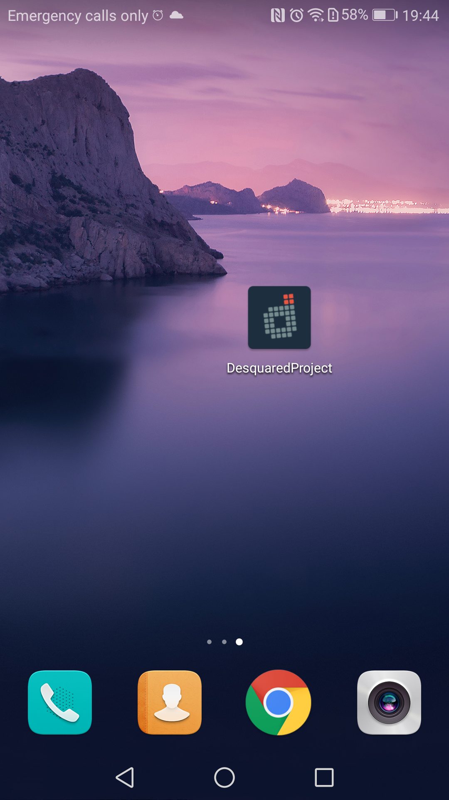
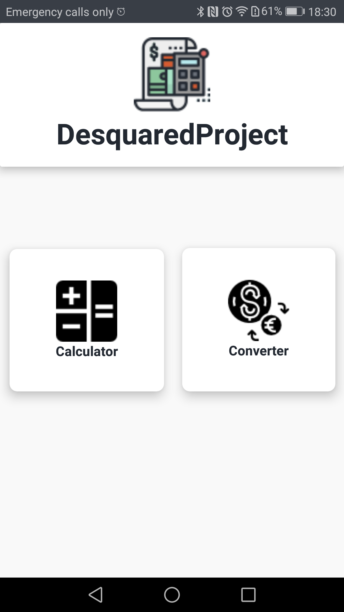
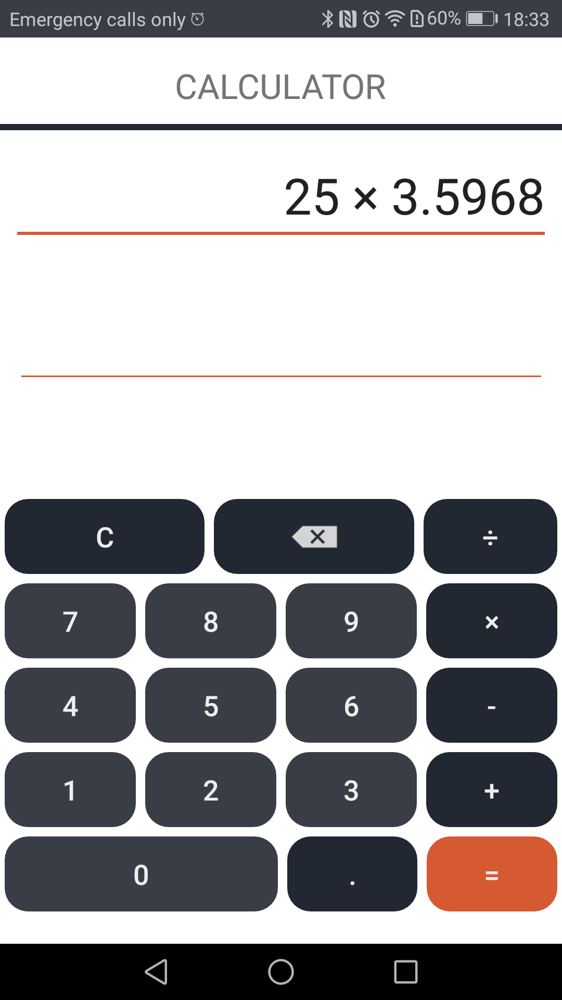
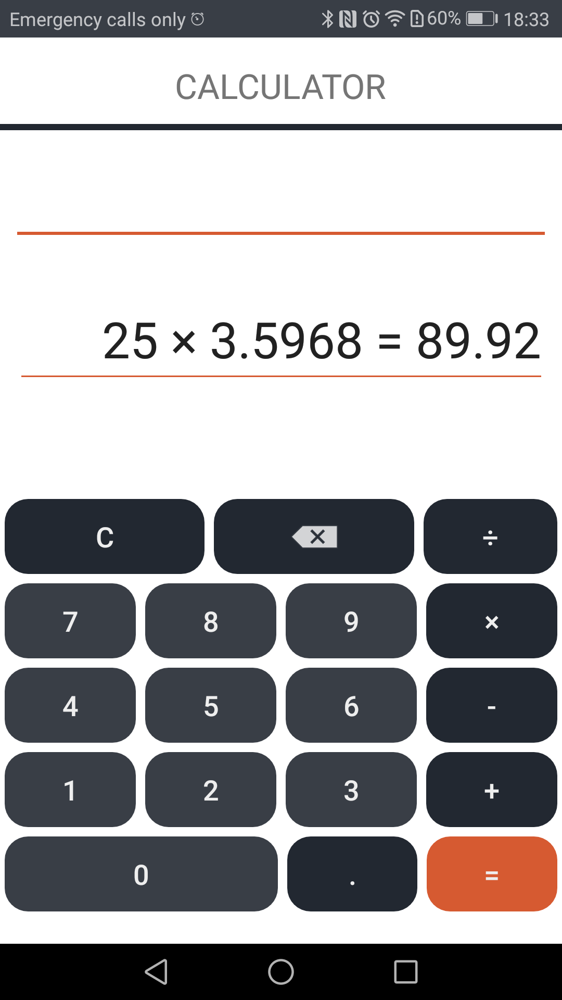
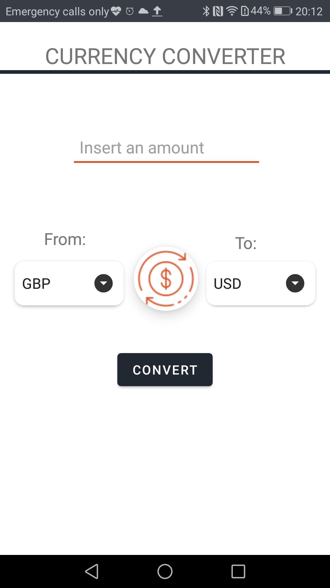
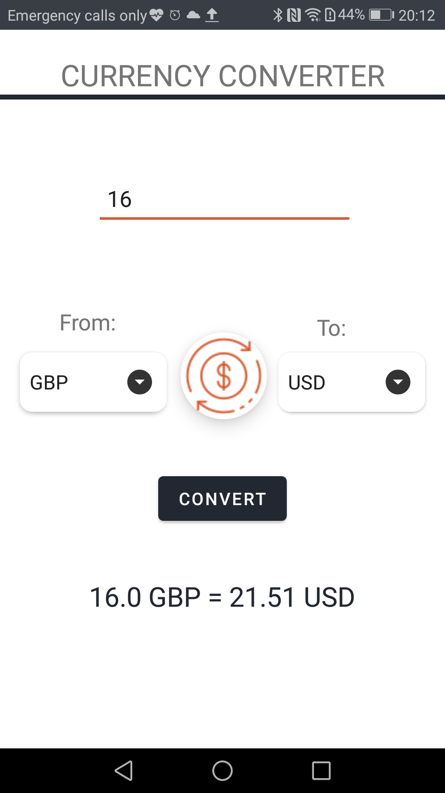
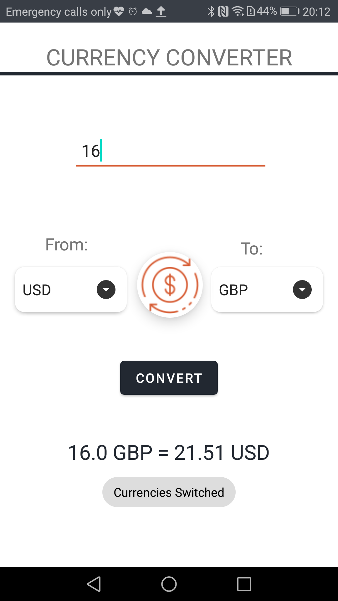
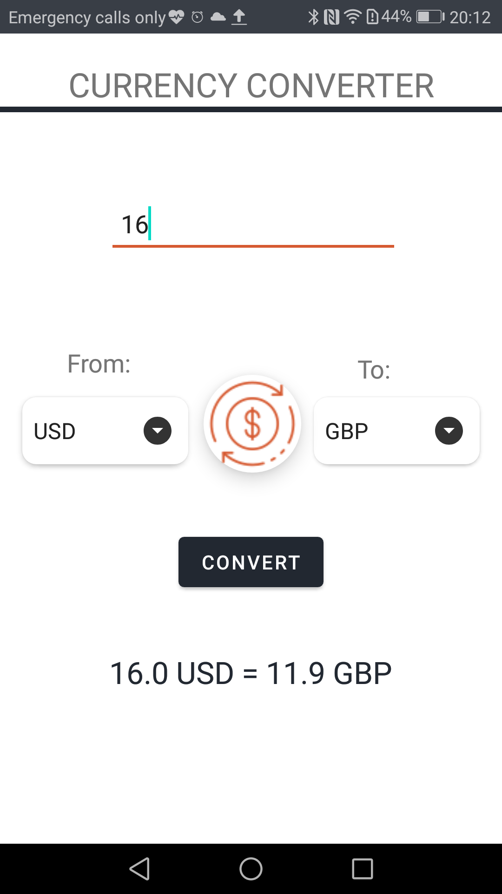

# Calculator_CurrencyConverter_AndroidStudio
This project was created as part of a job interview. It is a simple <b>calculator</b> and a <b>currency converter</b> application implemented using <b>Android Studio</b>.

## App Preview  
  

## Homepage / MainActivity 
On this page, user may choose which service he wants to use.   
  

## Calculator / CalculatorActivity 
It's a simple, not scientific, calculator where user can perform one mathematical operation at a time. There are two EditTexts. The first one displays the user's input while the second one is used to display the result. 
When "=" is pressed, the summary is displayed on the bot EditText and the top EditText is getting cleared.  
  
  

## Currency Converter / ConverterActivity 
All currencies are imported from a public API (fixer.io), so prices are updated everyday. User can convert an amount between different currencies by selecting them from the two spinners (From/To).  
  
  
### He also has the ability to switch between "from" and "to" currencies by clicking the middle button.  
  
  
